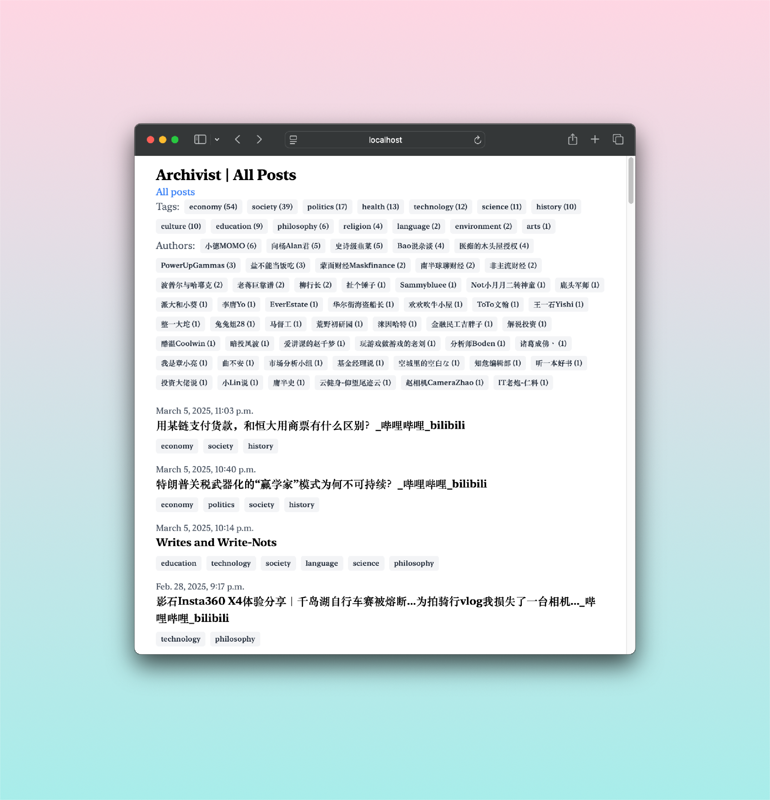

# Archivist

**Archivist** is designed to efficiently manage and process consumed content, primarily from video platforms such as Bilibili and YouTube. Future updates will extend support to additional content types.

## Key Features

1. **Content Management**: Handles video content from public platforms, extracting and organizing information for further processing.
2. **Data Processing**: Provides flexible processing capabilities, including:
   - **Tagging**
   - **Summarization**
   - **Idea and insight generation**
3. **Extensibility**: Built with simple, modular mechanisms for easy expansion.

## Installation and Setup

### Prerequisites
- **Conda Installation**: Ensure Conda is installed on your system.
- **Environment Setup**: Create a new Conda environment and install the required dependencies.

### Environment Configuration
- Place the `.env` file in your user directory at `~/.power-llm.env`.
- Define necessary environment variables within the `.env` file.
- By default, the system reads from `~/.power-llm.env`, but you can specify a different path using the `POWER_LLM_ENV_PATH` environment variable.
- The output directory is also specified within this `.env` file.

## Fetching Video Transcripts

To retrieve a transcript from a video, run the following command:

```bash
get 'https://www.youtube.com/...' [output-dir]
```

- The transcript is saved as a JSON file, named after the video title.
- If `output-dir` is omitted, the file is saved in the default directory.

## Running Pipelines on Documents

Pipelines can be executed on existing documents to generate new summaries and insights. Usage:

```bash
mpipe pipeline [kwargs, [...]]
```

To generate tags for each document:

```bash
mpipe tag tags=learning,studying
```

To generate a briefing:

```bash
mpipe brief language=Japanese
```

## View Formatted Contents

To start a local server for browsing tagged posts, run the following command:

```bash
serve [argv...]
serve 8001
```

This equals to `manage.py runserver` in django.



## Future Enhancements

- ~~Implement cookie support~~: *Attempted but unsuccessful due to YouTube access restrictions via DC.*
- [x] Developed `mpipe`: A tool for tagging, rewriting, summarizing, and modifying stored files.
- [x] Add `Serve`: A server tool to display categorized pages for viewing collected content.


## References

- **You-Get**: A reliable tool for video content retrieval.
- **Hugging Face**: A powerful and user-friendly NLP framework supporting various processing tasks.
